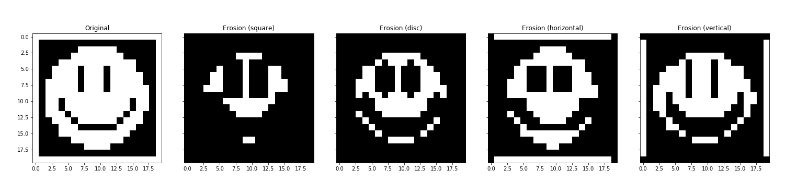

#### Morphologycal operations made with Python

##### To use

```python
import numpy as np
import matplotlib.pyplot as plt

from morph import *

selem = np.ones((3,3))
fm = FilterManager(selem)
eroded_img = fm.apply_filter('er', img)

plt.imshow(eroded_img)
```

##### Public methods

| Name | Description | Options |
| --- | --- | --- | 
| `apply_filter(operator='er', img=None, n_iterations=1, as_gray=False)` | Applies a morphological operator to an image multiple times (n_iterations) | Operators: `'er', 'di', 'op', 'cl', 'ig', 'eg', 'mg', 'wth', 'bth'` for Erosion, Dilation, Opening, Closing, Internal gradient, External gradient, Morphologycal gradient, White top-hat and Black top-hat respectively. `img` is a numpy array with values between 0 and 1 (grayscale). `as_gray` is either `True` or `False` to execute grayscale or binary operations (default `False`).
| `apply_threshold(img, threshold=.5)` | Applies the given threshold to a grayscale image, converting it into black and white (0,1) | `threshold` is a number between 0.0 and 1.0.
| `show(img, show_grid=True, show_ticks=False)` | Plot the given image (shorthand for plt.imshow with preset parameters) | 

##### Examples

Structuring elements:


Different filters applied to the original image:


A single filter applied multiple times to the original image:


Different structuring element types (3x3)


Different structuring element sizes


##### To Do

Fix performance issues if possible. Currently, skimage morphology operators are faster, even with big images. For example, using morph.py for 512x512 images, the erosion filter takes ~6s vs. ~100ms (skimage).
