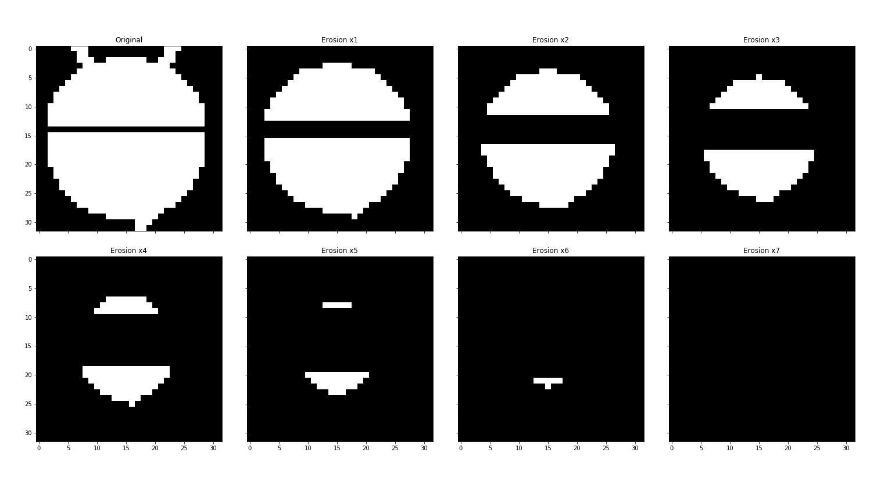

#### Morphologycal operations made with Python

##### How to use it

```python
import numpy as np
import matplotlib.pyplot as plt

from morph import *

selem = np.ones((3,3))
fm = FilterManager(selem)
eroded_img = fm.apply_filter('er', img)

plt.imshow(eroded_img)
```

##### Public methods

| Name | Description | Options |
| --- | --- | --- | 
| `apply_filter(operator='er', img=None, n_iterations=1, as_gray=False)`| Applies a morphological operator to an image multiple times (n_iterations) | operator: <ul><li>`'er'`: Erosion. </li><li>`'di'`: Dilation. </li><li>`'op'`: Opening. </li><li>`'cl'`: Closing. </li><li>`'ig'`: Internal gradient. </li><li>`'eg'`: External Gradient. </li><li>`'mg'`: Morphologycal gradient. </li><li>`'wth'`: White top-hat. </li><li>`'bth'`: Black top-hat. </li></ul> img: <ul><li> Any numpy array with values between 0 and 1, representing a grayscale image. (default=`None`)</li></ul> n_iterations: <ul><li> Integer number indicating how many times to apply the selected filter over an image. (default=`1`)</li></ul> as_gray: <ul><li> `True` or `False` indicating whether to proceed executing grayscale or binary operations (default=`False`). </li></ul> 
| `apply_threshold(img, threshold=.5)` | Applies the given threshold to a grayscale image, converting it into black and white (0,1) | threshold: <ul><li> Float number between 0.0 and 1.0. (default=`.5`) </li></ul>
| `show(img, show_grid=True, show_ticks=False)` | Plot the given image (shorthand for plt.imshow with preset parameters) | 

##### Examples

Structuring elements:


Different filters applied to the original image:


A single filter applied multiple times to the original image:


Different structuring element types (3x3)


Different structuring element sizes


Applying grayscale filters


##### To Do

Fix performance issues if possible. Currently, skimage morphology operators are faster, even with big images. For example, using morph.py for 512x512 images, the erosion filter takes ~6s vs. ~100ms (skimage).
